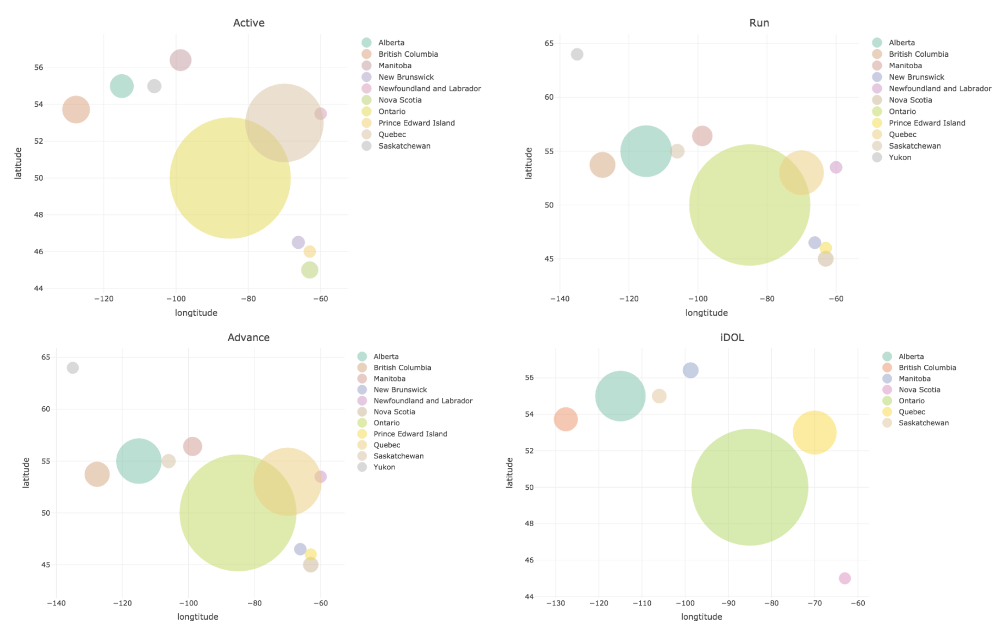

```{r, message = FALSE, echo=FALSE}
library(tidyverse)
library(lme4)
library(rvest)
library(polite)
library(lmtest)
library(wesanderson)
library(ggmap)
library(maps)
library(mapdata)
library(leaflet)
library(plotly)

# this should suppress all code and messages
knitr::opts_chunk$set(include=FALSE)
```

# General comments (you can delete this section)

_Before making any changes, knit this Rmd to PDF and change the name of the PDf to something like 'original-instructions.pdf', or whatever you like (it is just for your reference).. Then you can delete this section and if you want to check what it said, just open the other PDF. You don't HAVE to use this particular template, but you DO need to write you report in RMarkdown and include a cover page._

_The cover page must be a single stand alone page and have:_

*	_A title and subtitle (that indicate your findings)_
* _"Report prepared for MINGAR by" your company name_
*	_Date (assessment submission date is fine)_

_You can change the colour of this cover to any colour you would like by replacing 6C3082 in the YAML above (`titlepage-color:`) to another hex code. You could use this tool to help you:_ https://htmlcolorcodes.com/color-picker/

_Note: There should NOT be a table of contents on the cover page. It should look like a cover._

\newpage
# Executive summary

_Guidelines for the executive summary:_

* _No more than two pages_
* _Language is appropriate for a non-technical audience_
* _Bullet points are used where appropriate_
*	_A small number of key visualizations and/or tables are included_
*	_All research questions are addressed_


_The [module 4 writing prompt](https://sta303-bolton.github.io/sta303-w22-courseguide/knowledge-basket-writing-and-peer-feedback.html#module-4-writing-task) provides some tips and information about writing executive summaries._


\newpage
# Technical report
_This part of the report is much more comprehensive than the executive summary. The audience is statistics/data-minded people, but you should NOT include code or unformatted R output here._


## Introduction

_Provide a brief introduction to your report and outline what the report will cover. This section is valuable for setting scope and expectations. _

### Research questions
- How do the demographic for the traditional lines compare with that of the “Active and “Advance” lines?

- Are the devices “racist”?

- What are the main differences between different lines of the device?


## How do the demographic for the traditional lines compare with that of the “Active and “Advance” lines?

_For each research question, you will want to briefly describe any data manipulation, show some exploratory plots/summary tables, report on any methods you use (i.e. models you fit) and the conclusions you draw from these_


```{r}
device_cust <-read.csv("./data/device_cust.csv")
```

```{r fig.cap="Age of customer by device line", include=T, echo=F}

device_cust %>% ggplot(aes(x = age, fill=line)) + geom_histogram(bins = 30) +  facet_wrap("line") + theme_linedraw() + scale_fill_manual(values = wes_palette("Moonrise3"))
```

```{r}
province <- c(10, 11, 12, 13, 24, 35, 46, 47, 48, 59, 60, 61, 62)
province_name <- c("Newfoundland and Labrador", "Prince Edward Island","Nova Scotia", "New Brunswick", "Quebec", "Ontario", "Manitoba", "Saskatchewan", "Alberta", "British Columbia", "Yukon", "Northwest Territories", "Nunavut")
latitude <- c(53.5, 46, 45, 46.498390, 53, 50, 56.415211, 55, 55, 53.726669, 64, 62.135189, 70.453262)
longtitude <- c(-60, -63, -63, -66.159668, -70, -85,-98.739075, -106, -115, -127.647621, -135, -122.792473, -86.798981)
canada_pro<- data.frame(province = province, province_name = province_name, latitude=latitude,longtitude= longtitude)

device_cust$province <- substr(device_cust$CSDuid,1,2)
device_cust <- merge(device_cust, canada_pro, by="province")
province_data <- device_cust %>% group_by(province, line) %>% summarise(num = n(), province_name, latitude, longtitude) %>% unique()

province_data_active <- province_data[province_data$line == "Active",]
province_data_advance <- province_data[province_data$line == "Advance",]
province_data_run <- province_data[province_data$line == "Run",]
province_data_idol <- province_data[province_data$line == "iDOL",]
```

```{r include=F}
province_data_active %>% 
  plot_ly(x=~longtitude, y=~latitude, type="scatter", mode = "hover", color= ~province_name, size=~num, sizes = c(20, 200),  marker=list(sizemode="diameter", opacity=0.5)) %>% layout(title="Active")

province_data_advance %>%
  plot_ly(x=~longtitude, y=~latitude, type="scatter", mode = "hover", color= ~province_name, size=~num, sizes = c(20, 200),  marker=list(sizemode="diameter", opacity=0.5)) %>% layout(title="Advance")

province_data_run %>% 
  plot_ly(x=~longtitude, y=~latitude, type="scatter", mode = "hover", color= ~province_name, size=~num, sizes = c(20, 200),  marker=list(sizemode="diameter", opacity=0.5))%>% layout(title="Run")

province_data_idol %>%
  plot_ly(x=~longtitude, y=~latitude, type="scatter", mode = "hover", color= ~province_name, size=~num, sizes = c(20, 200),  marker=list(sizemode="diameter", opacity=0.5))%>% layout(title="iDOL")

```


```{r}
device_cust$sex_binary <-  as.factor(ifelse(device_cust$sex == "Female", 0,
                        ifelse(device_cust$sex == "Male", 1, NaN)))
mod <- glm(sex_binary ~ line, 
  family=binomial(link='logit'), data=device_cust, na.action =  na.exclude)
```

```{r}
device_cust$age_range <-  as.factor(ifelse(device_cust$age <= 12, "children",
                        ifelse(device_cust$age <= 18, "teenager",
                        ifelse(device_cust$age <= 59, "adult","senior adult"))))
kruskal.test(age_range ~ line, data = device_cust)
```


```{r}
income <-  read.csv("./data/median_income.csv")
group_income <- inner_join(device_cust, income) %>% select(c("line", "hhld_median_inc"))

group_income %>% ggplot(aes(x= hhld_median_inc)) + geom_histogram() + facet_wrap("line")
mod <- lm(hhld_median_inc ~ line, data = group_income)
summary(mod)

summary(aov(hhld_median_inc ~ line, data = group_income))
```


## How does race affect the accuracy of wearable devices?

```{r}
race_sleep_data <- read.csv("./data/race_sleep_data.csv")
skin_tone_palette <- c("#ffdbac", "#f1c27d", "#e0ac69", "#c68642", "#8d5524")

race_sleep_data <- race_sleep_data %>%
  mutate(skin_tone = fct_relevel(skin_tone, "light", "medium_light", "medium", "medium_dark", "dark"))

race_sleep_data %>% ggplot(aes(skin_tone, fill = skin_tone)) + geom_bar() + scale_fill_manual(values = skin_tone_palette) +theme_minimal()

race_sleep_data %>% ggplot(aes(x = flags, fill=skin_tone)) + geom_histogram(bins = 30) + scale_fill_manual(values = skin_tone_palette) + facet_wrap("skin_tone") + theme_linedraw()

```


## What are the main differences between different lines of the device?

```{r warning=FALSE}
device_data %>% 
  ggplot(aes(x = Released, y = `Recommended retail price`, color = Brand, shape = Brand)) +
  geom_point(size = 4) +
  labs(title = "Recommeded Retail price vs Released Date", 
       x = "Released Date",
       y = "Recommended Retail Price",
       caption = "Created by Mango in 2022") +
  theme_minimal()
```

```{r}
device_data %>% 
  ggplot(aes(y = ReleasedYr, color = Brand, fill = Brand)) +
  geom_bar(stat="count") +
  labs(title = "Number of realesed products vs Released Year", 
       x = "Released Year",
       y = "Number of Reealsed products",
       caption = "Created by Mango in 2022") +
  theme_minimal()
```


## Discussion

_In this section you will summarize your findings across all the research questions and discuss the strengths and limitations of your work. It doesn't have to be long, but keep in mind that often people will just skim the intro and the discussion of a document like this, so make sure it is useful as a semi-standalone section (doesn't have to be completely standalone like the executive summary)._

### Strengths and limitations

\newpage
# Consultant information
## Consultant profiles

*Complete this section with a brief bio for each member of your group. If you are completing the project individually, you only need to complete one for yourself. In that case, change the title of this section to 'Consultant profile' instead. Examples below. This section is only marked for completeness, clarity and professionalism, not 'truth' so you can write it as if we're a few years in the future. Put your current degree in as completed and/or add your first choice grad school program, whatever you like. What skills related skills would you most like to highlight? What job title do you want?*

**Statsy McStatsstats**. Statsy is a senior consultant with Eminence Analytics. She specializes in data visualization. Statsy earned her Bachelor of Science, Specialist in Statistics Methods and Practice, from the University of Toronto in 2023.

**Datana Scatterplot**. Datana is a junior consultant with Eminence Analytics. They specialize in reproducible analysis and statistical communication. Datana earned their Bachelor of Science, Majoring in Computer Science and Statistics from the University of Toronto in 2024.

## Code of ethical conduct

_This section should be fairly short, no more than half a page. Assume a general audience, much like your executive summary._

* _Make at least three relevant statements about your company's approach to ethical statistical consulting. These should be appropriately in line with professional conduct advice like the (Statistical Society of Canada Code of Conduct)[https://ssc.ca/sites/default/files/data/Members/public/Accreditation/ethics_e.pdf] or the (Ethical Guidelines for Statistical Practice from the American Statistical Society)[https://www.amstat.org/ASA/Your-Career/Ethical-Guidelines-for-Statistical-Practice.aspx]. For example, "the customer is always right" ISN'T the type of thing an ethical statistical consultant would include._
*	_Be very careful not to just copy and paste from these other documents! Put things in your own words._


\newpage
# References

_You don't need to cite course materials, but consider all the the places you got data from, as well as the packages used and R itself. These are all things you should consider citing. Likewise, you might use some external resources on the emoji skin tones/Fitzpatrick scale, etc._

\newpage
# Appendix

_These appendices should outline in more detail the steps taken to access the following datasets. They should NOT include code, but should briefly describe the steps and important considerations. I.e., show that you understand what needs to be considered when web scraping, protecting licensed data, etc._

## Web scraping industry data on fitness tracker devices

## Accessing Census data on median household income

## Accessing postcode conversion files


__Final advice: KNIT EARLY AND OFTEN!__
